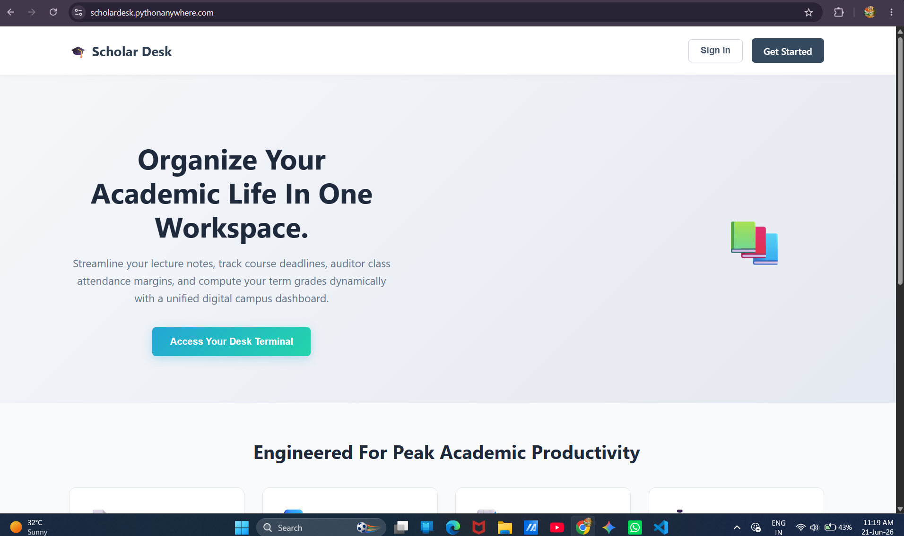
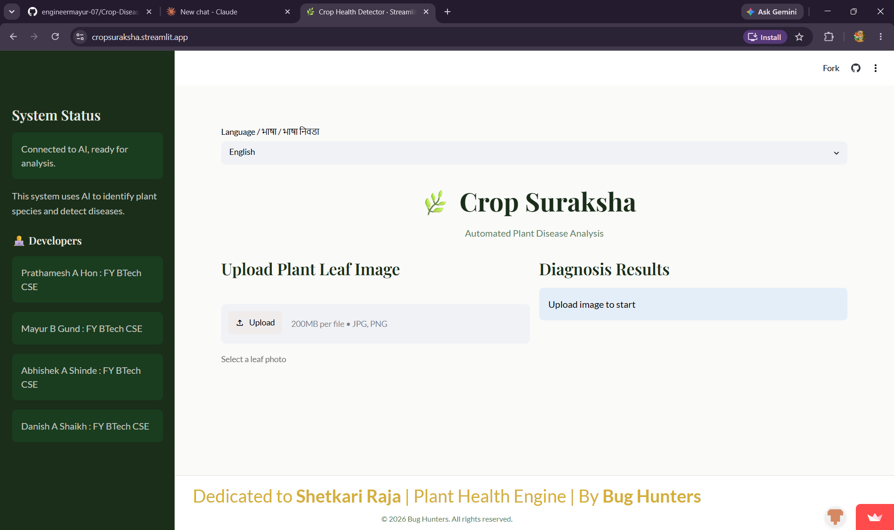
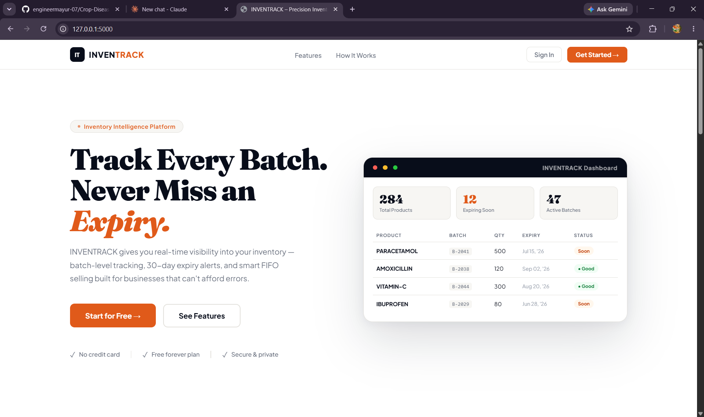

 

 

  

<!-- ============================= ABOUT ============================= -->

 

- 🎓 **2nd Year B.Tech CSE** at Sanjivani College of Engineering, Kopargaon
- 🏆 **Foundation For Excellence (FFE) Scholarship** Holder — merit earner, not just a learner
- 🐍 I build **real-world, fully deployed web apps** using Python & Flask
- 🌐 From **CLI tools to production web apps** — I ship things end-to-end
- 🤝 Networked with peers from **IITs & NITs** via FFE programs
- ✍️ I write about my tech journey, projects & growth at **[engineermayur.blogspot.com](https://engineermayur.blogspot.com)**
- 📍 Shirdi, Maharashtra, India

  

<!-- ============================= TECH STACK ============================= -->

 

<table align="center">
<tr>
<td align="right"><b>Languages</b></td>
<td>

</td>
</tr>
<tr>
<td align="right"><b>Frameworks</b></td>
<td>

</td>
</tr>
<tr>
<td align="right"><b>Databases</b></td>
<td>

</td>
</tr>
<tr>
<td align="right"><b>Tools</b></td>
<td>

</td>
</tr>
</table>

  

<!-- ============================= PROJECTS ============================= -->

 

### 📚 ScholarDesk — Academic Productivity Dashboard

Scholar Desk is a comprehensive, production-grade cloud ecosystem designed to serve as a unified academic command center for engineering students. Built using an enterprise monolithic architecture, it consolidates disparate student utilities into a seamless, high-contrast digital workspace.
Students currently waste cognitive energy jumping between fragmented, isolated applications (notepads, calendar apps, expense managers, and AI tabs). Scholar Desk completely resolves this fragmentation. * It centralizes data streams into a single environment.

   

👥 Built with <b>Arjun B. Kadam</b>

  

### 🗺️ Safarnama — AI-Powered Travel Planner

Safarnama is an intelligent, full-stack travel planning web application built using Streamlit, integrated with Google's Gemini 2.5 Flash API and geodetic positioning automation. It moves away from rigid, cookie-cutter tourism packages, allowing users to build dynamically calculated, completely customized itineraries with a built-in AI concierge.

  

👥 Built with <b>Rohit J. Khokale</b>

  

### 🌿 Crop Suraksha — AI Plant Disease Detector

The AI-Based Crop Disease Detection System is a mobile and web platform designed to analyze leaf images and instantly identify agricultural pathogens. Built under the team name Bug Hunters, the system serves as an automated digital plant pathologist for farmers.
Traditional disease identification requires manual expert inspection, which takes time and leads to severe crop loss. This system provides an instant, real-time diagnosis.

  

👥 Built with <b>Prathamesh Hon · Abhishek Shinde · Danish Shaikh</b>

  

### 📦 INVENTRACK — Inventory & Expiry Tracking System

A high-performance full-stack web application designed for businesses handling perishable goods (e.g., pharmacies, cloud kitchens) to optimize stock rotation and eliminate waste.

Instead of relying on heavy database sorting queries, this system utilizes an in-memory Min-Heap cache to track expiration dates with maximum efficiency

   

🔧 <b>In Active Development</b>

  

<!-- ============================= GITHUB STATS ============================= -->

 

 

 

  

  

<!-- ============================= BLOG ============================= -->

 

*I write about building projects, growing as a student developer, and the lessons only struggle can teach.*

  

<!-- ============================= CONNECT ============================= -->

 

&nbsp;

&nbsp;

  

⭐ From <a href="https://github.com/engineermayur-07">engineermayur-07</a> — Built with 💙 and endless cups of chai ☕

