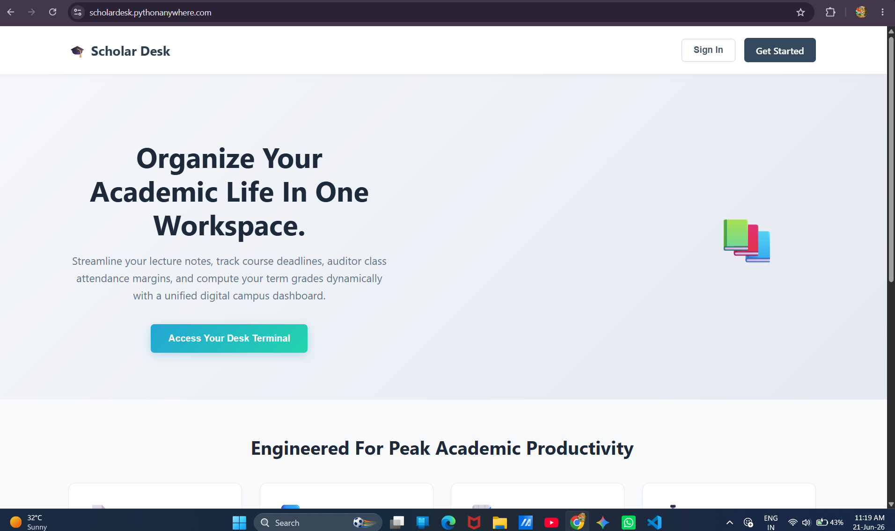
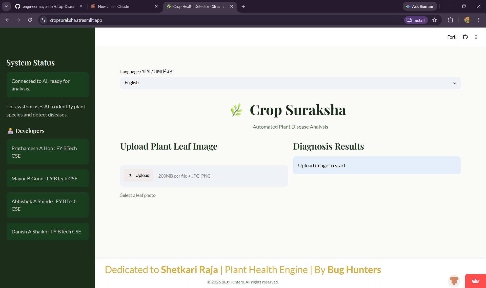
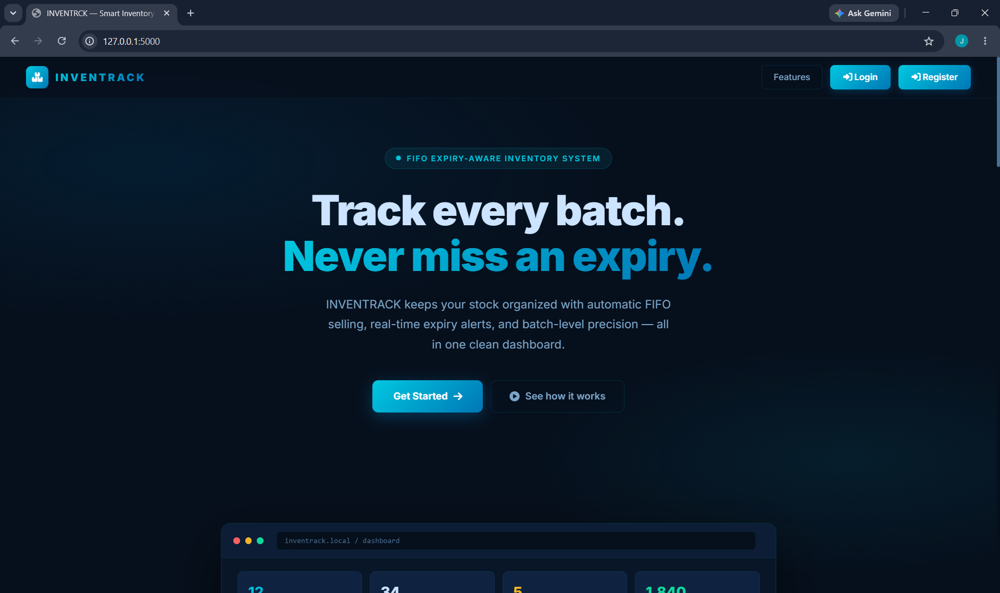

 

 

<!-- ============================= ABOUT ============================= -->
<h2 align="center">🧑‍💻 About Me</h2>

 

- 🎓 **2nd Year B.Tech CSE** at Sanjivani College of Engineering, Kopargaon
- 🏆 **Foundation For Excellence (FFE) Scholarship** Holder — merit earner, not just a learner
- 🐍 I build **real-world, fully deployed web apps** using Python & Flask
- 🌐 From **CLI tools to production web apps** — I ship things end-to-end
- 🤝 Networked with peers from **IITs & NITs** via FFE programs
- ✍️ I write about my tech journey, projects & growth at **[engineermayur.blogspot.com](https://engineermayur.blogspot.com)**
- 📍 Shirdi, Maharashtra, India

 

<!-- ============================= TECH STACK ============================= -->
<h2 align="center">🛠️ Tech Stack</h2>

 

<table>
<tr>
<td align="right"><b>Languages</b></td>
<td>

</td>
</tr>
<tr>
<td align="right"><b>Frameworks</b></td>
<td>

</td>
</tr>
<tr>
<td align="right"><b>Databases</b></td>
<td>

</td>
</tr>
<tr>
<td align="right"><b>Tools</b></td>
<td>

</td>
</tr>
</table>

 

<!-- ============================= PROJECTS ============================= -->
<h2 align="center">🚀 Featured Projects</h2>

 

### 📚 ScholarDesk — Academic Productivity Dashboard

ScholarDesk is a comprehensive, production-grade cloud ecosystem designed to serve as a unified academic command center for engineering students. Built using an enterprise monolithic architecture, it consolidates disparate student utilities — notepads, calendar apps, expense managers, AI tabs — into a single, seamless, high-contrast digital workspace.

👥 Built with <b>Arjun B. Kadam</b>

 

### 🗺️ Safarnama — AI-Powered Travel Planner

Safarnama is an intelligent, full-stack travel planning web application built using Streamlit, integrated with Google's Gemini 2.5 Flash API and geodetic positioning automation. It moves away from rigid, cookie-cutter tourism packages, letting users build dynamically calculated, fully customized itineraries with a built-in AI concierge.

👥 Built with <b>Rohit J. Khokale</b>

 

### 🌿 Crop Suraksha — AI Plant Disease Detector

The AI-based Crop Disease Detection System is a mobile and web platform designed to analyze leaf images and instantly identify agricultural pathogens. Built under the team name Bug Hunters, it serves as an automated digital plant pathologist for farmers, replacing slow manual inspection with instant, real-time diagnosis.

👥 Built with <b>Prathamesh Hon · Abhishek Shinde · Danish Shaikh</b>

 

### 📦 INVENTRACK — Inventory & Expiry Tracking System

A high-performance full-stack web application for businesses handling perishable goods (pharmacies, cloud kitchens) to optimize stock rotation and eliminate waste. Instead of relying on heavy database sorting queries, it uses an in-memory Min-Heap cache to track expiration dates with maximum efficiency.

🔧 <b>In Active Development</b>

 

### 🏥 MediCare Hospital — Multi-Role Hospital Management System

A full-stack Flask + PostgreSQL hospital web application featuring multi-role authentication (Patient / Doctor / Admin), OTP email verification, and end-to-end appointment booking — architected across dedicated blueprints, models, and templates.

🔧 <b>In Active Development</b>

 

<!-- ============================= SNAKE ANIMATION ============================= -->
<h2 align="center">🐍 Contribution Snake</h2>

 

<picture>
  <source media="(prefers-color-scheme: dark)" srcset="https://raw.githubusercontent.com/engineermayur-07/engineermayur-07/output/github-contribution-grid-snake-dark.svg" />
  <source media="(prefers-color-scheme: light)" srcset="https://raw.githubusercontent.com/engineermayur-07/engineermayur-07/output/github-contribution-grid-snake.svg" />
  
</picture>

 

 

<!-- ============================= HEATMAP ============================= -->
<h2 align="center">🔥 Contribution Heatmap</h2>

 

 

<!-- ============================= GITHUB STATS ============================= -->
<h2 align="center">📊 GitHub Stats</h2>

 

  
  

 

<!-- ============================= CONNECT ============================= -->
<h2 align="center">🤝 Let's Connect</h2>

 

 

⭐ From <a href="https://github.com/engineermayur-07">engineermayur-07</a> — Built with ❣️❣️ and endless cups of chai ☕

